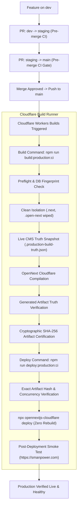

# Phase 1B.2A-S5: Safe Automatic Production Deployment

**Domain:** `https://smanpower.com`  
**Cloudflare Worker:** `smanpower-secure`  
**Authoritative Repository:** `https://github.com/alexsagar/smanpower-secure`  
**Production Branch:** `main`  
**Staging Branch:** `staging`  
**Development Branch:** `dev`  

---

## 1. Executive Summary

This document establishes the architecture, guarantees, configuration, and verification protocols for **Safe Automatic Production Deployments** for Seven Seas Intercontinental (`smanpower-secure`).

Whenever an approved pull request is merged from `staging` into `main`:
1. The production release pipeline starts automatically in Cloudflare Workers Builds.
2. All mandatory preflight safety checks and database content sanity gates execute.
3. A clean production build is generated with zero stale cache reuse.
4. The generated build output is verified against live CMS content truth.
5. The exact verified artifact is cryptographically certified with SHA-256 hashes.
6. The verified artifact deploys automatically to Cloudflare Workers with zero rebuild.
7. Automated live smoke tests execute across 7 critical route categories.
8. A complete audit log and release report are produced.

**No manual release command is required for routine deployments.**  
`npm run deploy:production:safe` remains available for supervised or emergency deployments.

---

## 2. Selected Automation Architecture

### Owner: Cloudflare Workers Builds (Single Deployment Owner)
Cloudflare Workers Builds is designated as the **single authoritative owner** of production releases.



### Why Option A (Cloudflare Workers Builds) Was Selected:
1. **Security & Least-Privilege**: Cloudflare already holds Worker bindings (R2, D1, Durable Objects) and production secrets within its security perimeter. No Cloudflare API keys or production database credentials need to be exported into external third-party CI runners.
2. **Zero Ingestion Overheads**: Native to Cloudflare's runtime infrastructure where `smanpower-secure` operates.
3. **Strict Gate Abort**: Cloudflare Workers Builds runs a two-step process: Build Command followed by Deploy Command. If `npm run build:production:ci` fails ANY check, the build terminates with a non-zero exit code, and Cloudflare **NEVER** runs the Deploy Command.
4. **Single Source of Truth**: Eliminates race conditions or competing releases from multiple deployment systems.

---

## 3. Production Pipeline Specification

### A. Production Build Command
```bash
npm run build:production:ci
```
Orchestrated by [`scripts/build-production-ci.mjs`](file:///D:/smanpower-clean-2026-07-13/scripts/build-production-ci.mjs):
1. **Branch & Source-Commit Verification**: Strictly verifies `branch === 'main'` and records `commitSha`.
2. **Environment & Secrets Guard**: Verifies `DATABASE_URL` is set, `APP_ENV=production`, `DEMO_MODE=false`, `QA_MODE=false`.
3. **Preflight Database Fingerprint**: Validates `DATABASE_URL` SHA-256 identity against `APPROVED_PROD_DB_HASHES`. Strictly rejects development or unrecognized databases.
4. **.env.local Defense**: Quarantines any local `.env.local` to prevent variable pollution.
5. **Content Sanity Gate**: Directly queries live Neon database read-only to assert:
   - Published `NewsArticle` records $\ge 1$
   - Active `Demand` records $\ge 3$
   - `CmsPage` records $\ge 50$
   - `InsightArticle` updated after August 2026
   - `MediaAsset` records $\ge 140$
6. **Clean Build Isolation**: Wipes `.next`, `.open-next`, `.wrangler`, `.production-build-truth.json`, and `.production-artifact-manifest.json`. Verifies clean state before compiling.
7. **Live Content Truth Snapshot**: Queries Neon database to generate `.production-build-truth.json` capturing authoritative news slugs, active demand slugs, homepage hero markers, and leadership name.
8. **OpenNext Cloudflare Compilation**: Runs `npx opennextjs-cloudflare build` in clean production environment.
9. **Generated Artifact Truth Verification**: Inspects compiled HTML in `.next/server/app` and cache in `.open-next/cache`:
   - Confirms all published news articles are present (no empty-state text).
   - Confirms active demands are present (no empty fallback).
   - Confirms homepage hero eyebrow, brand name, Google Translate, Organization schema.
   - Confirms leadership member and insight SSR without crash skeletons or OpenAI leaks.
   - Asserts fetch-cache timestamps are fresh ($mtime \ge buildStartTime$).
10. **Concurrency Stability Recheck**: Queries live database again post-compilation. If news or demand counts changed during the build, aborts to prevent releasing stale snapshots.
11. **Cryptographic Artifact Certification**: Computes SHA-256 hashes of `.open-next/worker.js`, `BUILD_ID`, and `news.html`, and writes `.production-artifact-manifest.json` with status `CERTIFIED_FOR_DEPLOYMENT`.

### B. Production Deploy Command
```bash
npm run deploy:production:ci
```
Orchestrated by [`scripts/deploy-production-ci.mjs`](file:///D:/smanpower-clean-2026-07-13/scripts/deploy-production-ci.mjs):
1. **Branch Verification**: Confirms current branch is `main`.
2. **Concurrency & Latest-Commit Guard**: Checks `git fetch origin main` to confirm local commit matches the latest `origin/main`. If another PR was merged while building, aborts to prevent deploying an outdated release.
3. **Artifact Certification Verification**: Verifies `.production-artifact-manifest.json` status is `CERTIFIED_FOR_DEPLOYMENT`, timestamp is fresh ($< 1$ hour), and commit SHA matches.
4. **Cryptographic Anti-Rebuild Gate**: Computes SHA-256 hashes of `.open-next/worker.js`, `BUILD_ID`, and `news.html` on disk and compares against certified manifest hashes. Rejects deployment if any byte changed.
5. **Pre-Deployment Worker Audit**: Captures current active Worker version ID via `npx wrangler deployments list`.
6. **Execution (Zero Rebuild)**: Deploys via `npx opennextjs-cloudflare deploy`. Re-verifies worker hash post-deploy to prove zero rebuild occurred.
7. **Post-Deployment Health Smoke Test**: Executes 7-category smoke test against `https://smanpower.com`.
8. **Rollback & Reporting**: If smoke test fails, outputs instant rollback command (`npx wrangler rollback <previousVersionId> --yes`) and exits with code 1.

---

## 4. Pre-Merge vs Post-Merge Safety Split

| Safety Stage | Execution Context | Triggers | Security & Data Access |
| :--- | :--- | :--- | :--- |
| **Pre-Merge Validation** | GitHub Actions (`.github/workflows/ci.yml`) | Pull Requests to `staging` or `main` | **Zero secrets required.** Runs ESLint, TypeScript `typecheck`, and 64 deployment safety unit tests using mock state. |
| **Post-Merge Release** | Cloudflare Workers Builds | Push / Merge to `main` | **Full production context.** Runs live database sanity, clean isolation, live content truth verification, exact-artifact deployment, and live smoke tests. |

---

## 5. Cloudflare Dashboard Configuration Cutover

To activate this hardened automatic deployment pipeline in Cloudflare:

1. Log in to [Cloudflare Dashboard](https://dash.cloudflare.com/) (Account: `seasseven123@gmail.com`).
2. Navigate to: **Workers & Pages** > **smanpower-secure** > **Settings** > **Builds**.
3. In the **Build settings** section, click **Edit**:
   - **Build command**:
     ```bash
     npm run build:production:ci
     ```
   - **Deploy command**:
     ```bash
     npm run deploy:production:ci
     ```
4. In the **Build variables and secrets** section:
   - Add variable: `DATABASE_URL` (Value: pooled Neon connection string from `.env.production`).
   - Add variable: `APP_ENV` = `production`.
5. Under **Branch control**:
   - Production branch: `main`.
   - Ensure **Builds for non-production branches** is **UNCHECKED** (prevents preview builds from running against production data).
6. Click **Save**.

---

## 6. Rollback & Emergency Runbook

### Automatic Rollback Guidance
If any post-deployment smoke test check fails, the pipeline immediately outputs:
```bash
🚨 CRITICAL: IMMEDIATE ROLLBACK REQUIRED!
Execute the following command immediately to restore the prior good version:

   npx wrangler rollback <previousVersionId> --yes
```

### Manual Emergency Release Procedure
If an emergency hotfix must be deployed directly from a supervised terminal:
```bash
git checkout main
git pull origin main
npm run deploy:production:safe
```
This runs the identical hardened pipeline (`buildProductionCi` + `deployProductionCi`) locally.
